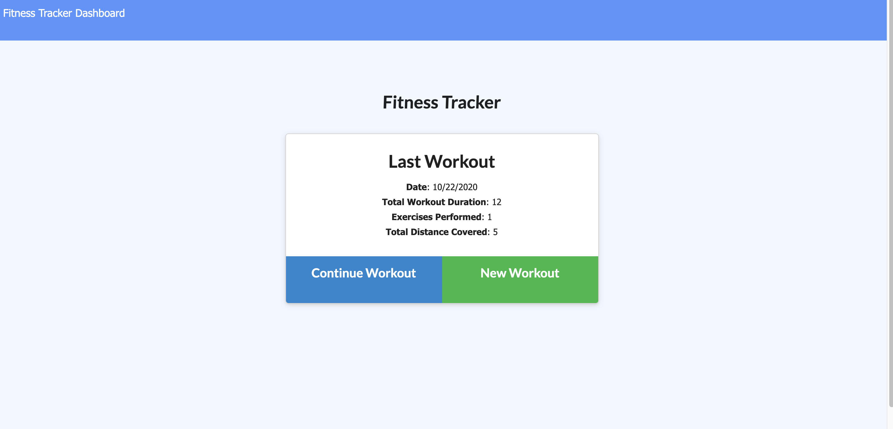
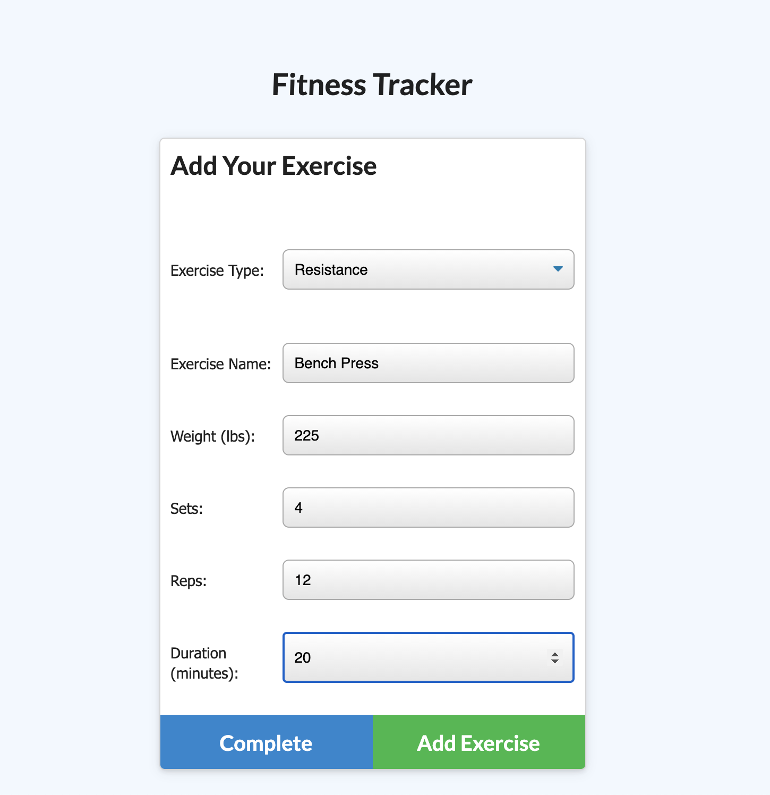
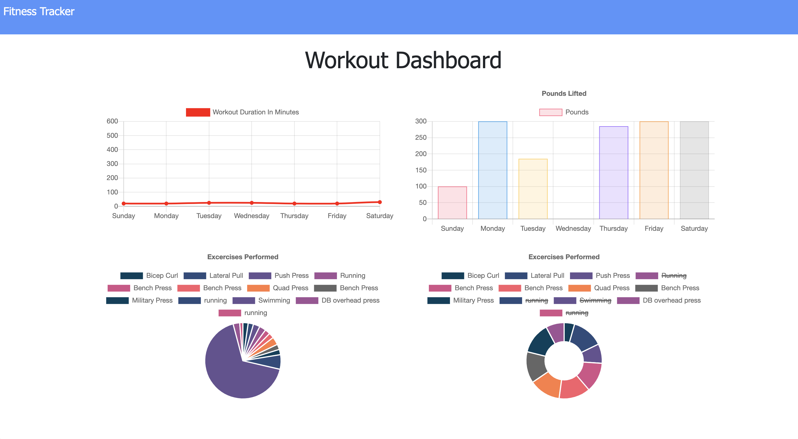

# Fitness Tracker
[CLICK HERE FOR LIVE HEROKU APPLICATION](https://fitnesstracker1023.herokuapp.com/)

## Table of Contents
* [Screenshots](#screenshots)

* [User Story](#user-story)

* [Application Description](#application-description)

* [Installation](#installation)

* [Usage](#usage)

* [Demo](#demo)

* [Built With](#built-with)

* [Contributors](#contributors)

* [License](#license)

* [Questions](#questions)

## Screenshots 





## User Story
```
As a user, I want to be able to view create and track daily workouts. I want to be able to log multiple exercises in a workout on a given day. I should also be able to track the name, type, weight, sets, reps, and duration of exercise. If the exercise is a cardio exercise, I should be able to track my distance traveled.


```

## Application Description

An application that lets the users input workouts that will be saved to a database then they can view there workouts in a dashboard and see the total time and weight they lifted on a 7 day average. The user can also add to the workout multiple exercises resistance and cardio and view the total when they click complete.
## Installation 
```
npm i 
```

## Usage 
```
Run "node server.js" to start then navigate to a browser window to localhost:3636

OR
                                     
Use the live application via the Heroku link provided above

```

## Built With
* Heroku
* MongoDB
* Mongoose
* Express
* Node
* Morgan
* JSON
* JQuery 


## Contributors 


 Max Goldstein
* Github: [maxgoldstein93](https://github.com/maxgoldstein93) 
* Email: <magoldstein93@gmail.com>

## License

[](https://opensource.org/licenses/MIT)

Copyright 2020 ©Max Goldstein

<sup>Permission is hereby granted, free of charge, to any person obtaining a copy of this software and associated documentation files (the "Software"), to deal in the Software without restriction, including without limitation the rights to use, copy, modify, merge, publish, distribute, sublicense, and/or sell copies of the Software, and to permit persons to whom the Software is furnished to do so, subject to the following conditions:
  
<sup>The above copyright notice and this permission notice shall be included in all copies or substantial portions of the Software.
  
<sup>THE SOFTWARE IS PROVIDED "AS IS", WITHOUT WARRANTY OF ANY KIND, EXPRESS OR IMPLIED, INCLUDING BUT NOT LIMITED TO THE WARRANTIES OF MERCHANTABILITY, FITNESS FOR A PARTICULAR PURPOSE AND NONINFRINGEMENT. IN NO EVENT SHALL THE AUTHORS OR COPYRIGHT HOLDERS BE LIABLE FOR ANY CLAIM, DAMAGES OR OTHER LIABILITY, WHETHER IN AN ACTION OF CONTRACT, TORT OR OTHERWISE, ARISING FROM, OUT OF OR IN CONNECTION WITH THE SOFTWARE OR THE USE OR OTHER DEALINGS IN THE SOFTWARE.

## Questions

If you have any questions regarding this repo, please contact me via Github or email.
